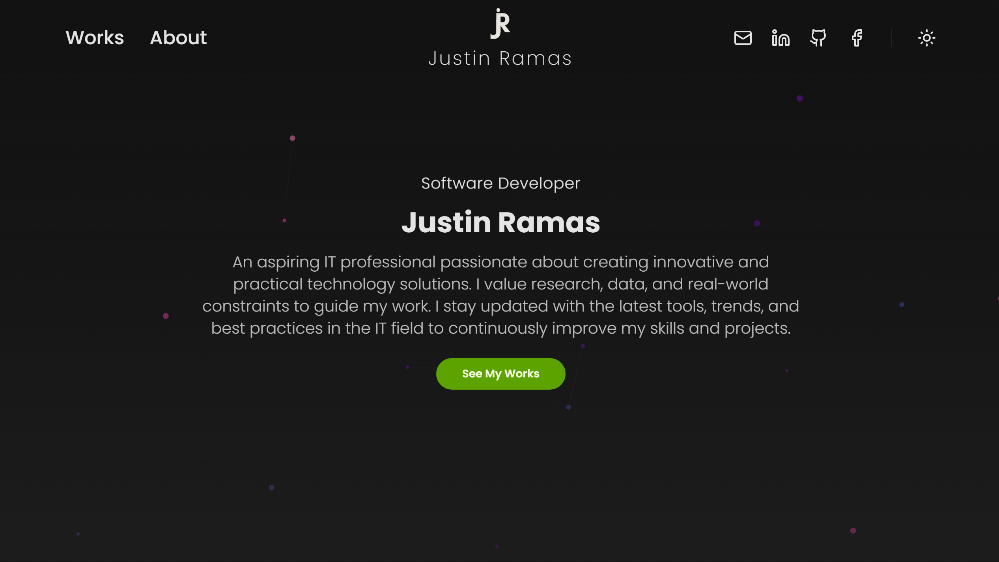

# Justin Ramas | Personal Portfolio

 > **Live Site:** [https://senryuu286.github.io/](https://senryuu286.github.io/)

A modern, highly optimized personal portfolio built to showcase my frontend development skills, academic journey as a BSIT student, and personal projects. Designed with a focus on clean UI/UX, smooth animations, and top-tier performance.

## Tech Stack

This project was built using modern frontend technologies to ensure a fast, scalable, and maintainable codebase:

* **Framework:** React (via Vite for lightning-fast module replacement)
* **Styling:** Tailwind CSS + DaisyUI (utility-first styling for rapid UI development)
* **Animations:** Framer Motion (hardware-accelerated scroll and layout animations)
* **Routing:** React Router DOM (client-side routing with hash-link scroll restoration)
* **Icons:** Lucide React (lightweight, highly customizable SVG icons)

